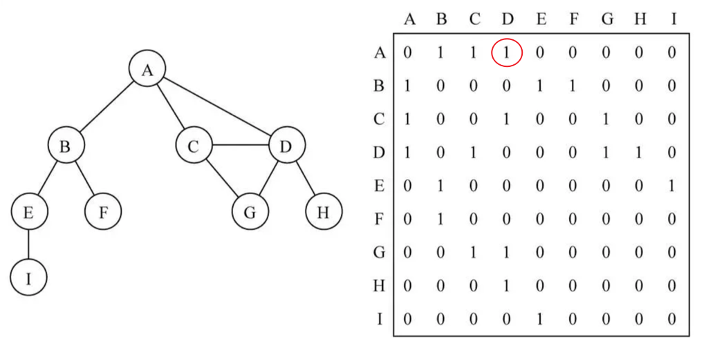
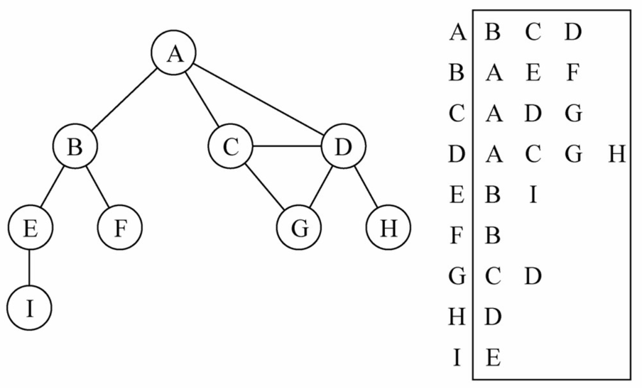

## 10.1.图的简介
**什么是图？**

- 图结构是一种与树结构有些相似的数据结构；
- 图论是数学的一个分支，并且，在数学中，树是图的一种；
- 图论以图为研究对象，研究顶点和边组成的图形的数学理论和方法；
- 主要的研究目的为：事物之间的联系，顶点代表事物，边代表两个事物间的关系；

**图的特点：**

- 一组顶点：通常用 V （Vertex）表示顶点的集合；
- 一组边：通常用 E （Edge）表示边的集合；
    * 边是顶点和顶点之间的连线；
    * 边可以是有向的，也可以是无向的。比如A----B表示无向，A ---> B 表示有向；

**图的常用术语：**

顶点：表示图中的一个节点；

边：表示顶点和顶点给之间的连线；

相邻顶点：由一条边连接在一起的顶点称为相邻顶点；

度：一个顶点的度是相邻顶点的数量；

路径：

简单路径：简单路径要求不包含重复的顶点；
回路：第一个顶点和最后一个顶点相同的路径称为回路；
无向图：图中的所有边都是没有方向的；

有向图：图中的所有边都是有方向的；

无权图：无权图中的边没有任何权重意义；

带权图：带权图中的边有一定的权重含义；

#### 10.1.1 .图的表示
- 邻接矩阵

表示图的常用方式为：邻接矩阵。

(1)可以使用二维数组来表示邻接矩阵；

(2)邻接矩阵让每个节点和一个整数相关联，该整数作为数组的下标值；

(3)使用一个二维数组来表示顶点之间的连接；



如上图所示：

二维数组中的0表示没有连线，1表示有连线；

若为无向图，则邻接矩阵应为对角线上元素全为0的对称矩阵；

**邻接矩阵的问题：**

如果图是一个稀疏图，那么邻接矩阵中将存在大量的 0，造成存储空间的浪费；

- 邻接表

另外一种表示图的常用方式为：邻接表。

(1)邻接表由图中每个顶点以及和顶点相邻的顶点列表组成；       
(2)这个列表可用多种方式存储，比如：数组/链表/字典（哈希表）等都可以；



如上图所示：

图中可清楚看到A与B、C、D相邻，假如要表示这些与A顶点相邻的顶点（边），可以通过将它们作为A的值（value）存入到对应的数组/链表/字典中。

之后，通过键（key）A可以十分方便地取出对应的数据；

**邻接表的问题：**

邻接表可以简单地得出出度，即某一顶点指向其他顶点的个数；

但是，邻接表计算入度（指向某一顶点的其他顶点的个数称为该顶点的入度）十分困难。此时需要构造逆邻接表才能有效计算入度；

## 10.2.图的封装

在实现过程中采用**邻接表**的方式来表示边，使用**字典类**来存储邻接表。

#### 10.2.1 添加字典类和队列类
首先需要引入之前实现的，之后会用到的字典类和队列类：

#### 10.2.2 创建图结构

先创建图类Graph，并添加基本属性，再实现图类的常用方法：

```js
function Graph() {
    //顶点（数组）和 边（字典）
    this.vertexes = [];  //顶点
    this.edges = new Dictionary();  //边
}
```

#### 10.2.3 添加顶点和边


如图所示：

创建一个数组对象vertexes存储图的顶点；创建一个字典对象edges存储图的边，其中key为顶点，value为存储key顶点相邻顶点的数组。

代码实现：

```js
    //添加顶点
    Graph.prototype.addVertex = function(v) {
        this.vertexes.push(v);

        //将边添加到字典中，新增的顶点作为键，对应的值为一个存储边的空数组(还没有边)
        this.edges.set(v,[]);
    }

    //添加边的方法
    Graph.prototype.addEdge = function(v1,v2) {  //两个顶点连成的边
        this.edges.get(v1).push(v2);//取出字典对象edges中存储边的数组，并添加关联顶点
        this.edges.get(v2).push(v1);//因为是无向图，所以需要天骄相互指向的边
    }
```

#### 10.2.4 转换为字符串输出
为图类Graph添加toString方法，实现以邻接表的形式输出图中各顶点。

**代码实现：**
```js
    Graph.prototype.toString = function() {
        //1.定义字符串，保存最终结果
        let retString = '';

        //2.遍历所有的顶点和顶点对应的边
        for(let i=0; i<this.vertexes.length;i++) {
            retString += this.vertexes[i] + '-->';
            let vEdges = this.edges.get(this.vertexes[i]);  //通过顶点获得其对应边的数组
            for(let j=0; j<vEdges.length;j++) {
                retString +=  vEdges[j] + ' '
            }
            retString += '\n';
        }
        return retString;
    }
```

**测试：**
```js
let graph = new Graph()

//2.添加顶点
let myVertexes = ['A', 'B', 'C', 'D', 'E', 'F', 'G', 'H', 'I']
for (let i = 0; i < myVertexes.length; i++) {
    graph.addVertex(myVertexes[i])
}

//3.添加边
graph.addEdge('A', 'B')
graph.addEdge('A', 'C')
graph.addEdge('A', 'D')
graph.addEdge('C', 'D')
graph.addEdge('C', 'G')
graph.addEdge('D', 'G')
graph.addEdge('D', 'H')
graph.addEdge('B', 'E')
graph.addEdge('B', 'F')
graph.addEdge('E', 'I')

//2.输出结果
console.log(graph.toString());
```
**结果：**

```js
A-->B C D 
B-->A E F 
C-->A D G 
D-->A C G H 
E-->B I 
F-->B 
G-->C D 
H-->D 
I-->E 
```

## 10.3.图的遍历

### 10.3.1 广度优先搜索

### 10.3.2 深度优先搜索


