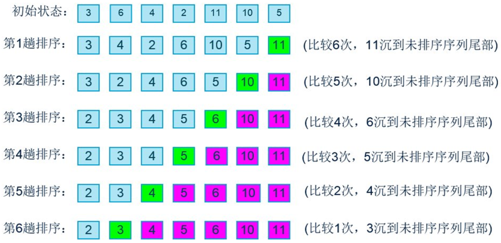
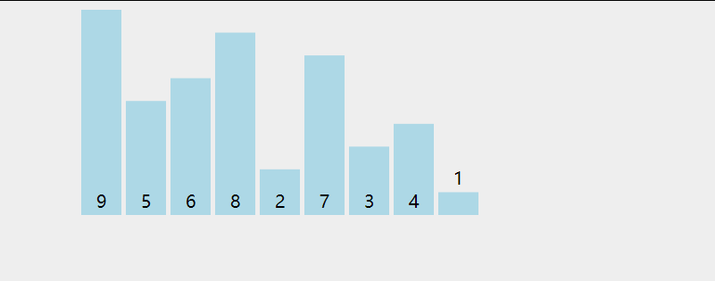
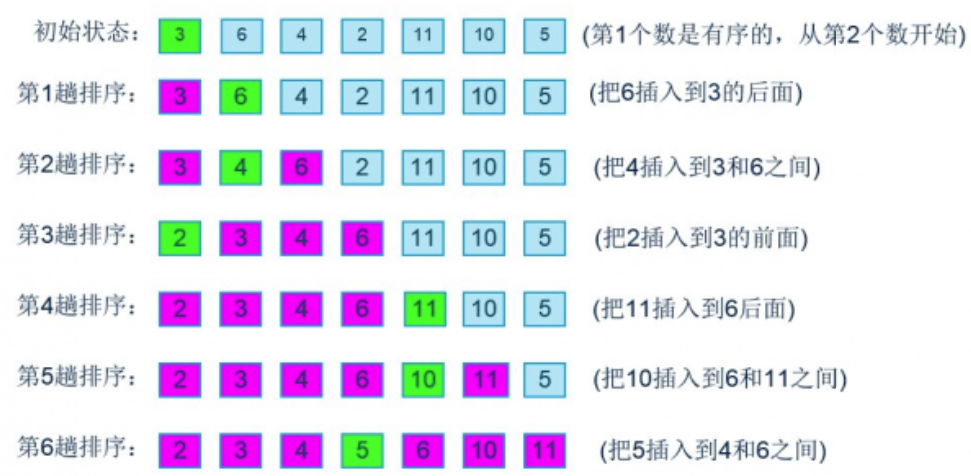

## 11.排序算法概述
主要介绍几种简单排序和高级排序
- **简单排序：**冒泡排序、选择排序、插入排序
- **高级排序：**希尔排序、快速排序；

此处创建一个列表类ArrayList并添加一些属性和方法，用于存放这些排序方法：

```js
function ArrayList() {
  //属性
  this.array = [];

  //方法
  //将数据插入到数组中
  ArrayList.prototype.insert = function(item) {
    this.array.push(item);
  }
  //toString方法
  ArrayList.prototype.toString = function() {
    return this.array.join('-');
  }
  //交换两个位置的数据
  ArrayList.prototype.swap = function(m,n) {
    let temp = this.array[m];
    this.array[m] = this.array[n];
    this.array[n] = temp;
  }
}
```

### 11.1冒泡排序

**冒泡排序的思路：**

- 对未排序的各元素从头到尾依次比较相邻的两个元素大小关系；
- 如果左边的人员高，则将两人交换位置。比如1比2矮，不交换位置；
- 向右移动一位，继续比较2和3，最后比较 length - 1 和 length - 2这两个数据；
- 当到达最右端时，最高的人一定被放在了最右边；
- 按照这个思路，从最左端重新开始时，只需要走到倒数第二个位置即可；


**实现思路：**

- 外层循环控制冒泡趟数：

    * 第一次：j = length - 1，比较到倒数第一个位置 ；
    * 第二次：j = length - 2，比较到倒数第二个位置 ；

- 内层循环控制每趟比较的次数：

    * 第一次比较： i = 0，比较 0 和 1 位置的两个数据；
    * 最后一次比较：i = length - 2,比较length - 2和 length - 1两个数据；

**详细过程如下图所示：**



**动态过程**


**代码实现**

```js
  //冒泡排序
  ArrayList.prototype.bubblesor = function() {
    //1。获取数组的长度
    let lenght = this.array.length;

    //2.外循环控制冒泡的趟次
    for(let i=lenght-1;i>=0;i--) {
      for(let j=0;j<i;j++) {
        if(this.array[j] > this.array[j+1]) {
          this.swap(j,j+1);
        }
      }
    }
  }
```
测试：
```js
let list = new ArrayList()

//插入元素
list.insert(66)
list.insert(88)
list.insert(12)
list.insert(87)
list.insert(100)
list.insert(5)
list.insert(566)
list.insert(23)

//验证冒泡排序
list.bubblesor()
console.log(list.toString());

//结果：
5-12-23-66-87-88-100-566
```

**冒泡排序的效率：**

- 上面所讲的对于7个数据项，比较次数为：6 + 5 + 4 + 3 + 2 + 1;
- 对于N个数据项，比较次数为：(N - 1) + (N - 2) + (N - 3) + ... + 1 = N * (N - 1) / 2；如果两次比较交换一次，那么交换次数为：N * (N - 1) / 4；
- 使用大O表示法表示比较次数和交换次数分别为：O（ N * (N - 1) / 2）和O（ N * (N - 1) / 4），根据大O表示法的三条规则都化简为：O（N^2）;

### 11.2 选择排序

**选择排序改进了冒泡排序：**

- 将交换次数由O（N^2）减小到O（N）；
- 但是比较次数依然是O（N^2）；

**选择排序的思路：**

- 选定**第一个索引**的位置比如1，然后依次和后面的元素依次进行比较；
- 如果后面的元素，小于索引1位置的元素，则**交换位置**到索引1处；
- 经过一轮的比较之后，可以确定一开始指定的索引1位置的元素是最小的；
- 随后使用同样的方法除索引1以外逐个比较剩下的元素即可；
- 可以看出选择排序，第一轮会选出最小值，第二轮会选出第二小的值，直到完成排序。

**实现思路：**

两层循环：

- 外层循环控制指定的索引：

    * 第一次：j = 0，指定第一个元素 ；
    * 最后一次：j = length - 1，指定最后一个元素 ；
- 内层循环负责将指定索引（i）的元素与剩下（i - 1）的元素进行比较；

**动态过程：**



代码实现：

```js
      //选择排序
      ArrayList.prototype.selectionSort = function(){
        //1.获取数组的长度
        let length = this.array.length

        //2.外层循环：从0开始获取元素
        for(let j = 0; j < length - 1; j++){
          let min = j
          //内层循环：从i+1位置开始，和后面的元素进行比较
        for(let i = min + 1; i < length; i++){
          if (this.array[min] > this.array[i]) {
            min = i
          }
        }
        this.swap(min, j)
        }
      }
```
测试代码：

```js

    //测试类
    let list = new ArrayList()

    //插入元素
    list.insert(66)
    list.insert(88)
    list.insert(12)
    list.insert(87)
    list.insert(100)
    list.insert(5)
    list.insert(566)
    list.insert(23)
    
    //验证选择排序
    list.selectionSort()
    console.log(list);

```
**选择排序的效率：**

- 选择排序的比较次数为：N * (N - 1) / 2，用大O表示法表示为：O（N^2）;
- 选择排序的交换次数为：(N - 1) / 2，用大O表示法表示为：O（N）;
- 所以选择排序的效率高于冒泡排序；-

### 11.3 插入排序
插入排序是简单排序中效率最高的一种排序。

**插入排序的思路：**

- 插入排序思想的核心是局部有序。如图所示，X左边的人称为局部有序；
- 首先指定一数据X（从第一个数据开始），并将数据X的左边变成局部有序状态；
- 随后将X右移一位，再次达到局部有序之后，继续右移一位，重复前面的操作直至X移至最后一个元素。

**插入排序的详细过程：**



**动态过程：**


**代码实现**

```js
      //插入排序
      ArrayList.prototype.insertionSort = function(){
        //1.获取数组的长度
        let length = this.array.length

        //2.外层循环:从第二个数据开始，向左边的已经局部有序数据进行插入
        for(let i = 1; i < length; i++){
          //3.内层循环：获取i位置的元素，使用while循环(重点)与左边的局部有序数据依次进行比较
          let temp = this.array[i]
          let j = i
          while(this.array[j - 1] > temp && j > 0){
            this.array[j] = this.array[j - 1]//大的数据右移
            j--
          }
          //4.while循环结束后，index = j左边的数据变为局部有序且array[j]最大。此时将array[j]重置为排序前的数据array[i]，方便下一次for循环
          this.array[j] = temp
        }
      }
```
测试代码：

```js
   //测试类
    let list = new ArrayList()

    //插入元素
    list.insert(66)
    list.insert(88)
    list.insert(12)
    list.insert(87)
    list.insert(100)
    list.insert(5)
    list.insert(566)
    list.insert(23)
    // console.log(list);

    //验证插入排序
    list.insertionSort()
    console.log(list);

```

**插入排序的效率：**

- 比较次数：第一趟时，需要的最大次数为1；第二次最大为2；以此类推，最后一趟最大为N-1；所以，插入排序的总比较次数为N * (N - 1) / 2；但是，实际上每趟发现插入点之前，平均只有全体数据项的一半需要进行比较，所以比较次数为：N * (N - 1) / 4；

- 交换次数：指定第一个数据为X时交换0次，指定第二个数据为X最多需要交换1次，以此类推，指定第N个数据为X时最多需要交换N - 1次，所以一共需要交换N * (N - 1) / 2次，平局次数为N * (N - 1) / 2；

- 虽然用大O表示法表示插入排序的效率也是O（N^2），但是插入排序整体操作次数更少，因此，在简单排序中，插入排序效率最高；


