## 1.栈
栈是一个线性结构，在计算机中是一种相当常见的数据结构。
### 1.1 栈与数组对比
我们知道数组是一种**线性结构**，并且可以在数组的**任意位置**插入和删除数据。但是有时候，我们为了实现某些功能，必须对这种任意性加以限制。而**栈和队列**就是比较常见的**受限线性结构**，我们先从栈开始介绍。
 
栈的特点：**先进先出（LIFO）**
- 其限制是仅允许在**表的一端**进行插入和删除运算，这一端被称为**栈顶**，相对地，把另一端称为**栈底**。
- LIFO表示就是后进入的元素，第一个弹出栈空间，类似自动餐托盘，最后放上的托盘，往往先把它拿出去使用。
- 向一个栈插入新元素又称**进栈、入栈**或者**压栈**，它是把新元素放到栈顶元素的上面，使之成为新的栈顶元素；
- 从一个栈删除元素又称作**出栈**或者**退栈**，它是把栈顶元素删除掉，使其相邻的元素成为新的栈顶元素。
### 1.2 栈的实现
#### 1.2.1 栈的常见操作
- push（element）：添加一个新元素到栈顶位置；
- pop（）：移除栈顶的元素，同时返回被移除的元素；
- peek（）：返回栈顶的元素，不对栈做任何修改（该方法不会移除栈顶的元素，仅仅返回它）；
- isEmpty（）：如果栈里没有任何元素就返回true，否则返回false；
- size（）：返回栈里的元素个数。这个方法和数组的length属性类似；
- toString（）：将栈结构的内容以字符串的形式返回。
#### 1.2.2 栈的封装
```js
//封装栈类
function Stack() {
    //栈中的属性
    this.items = [];

    //栈的相关操作
    //1.push(): 将元素压入栈
    //方法一（不推荐）：给当前兑现添加的方法，其他对象不能使用
    /* this.push = () => {

    } */

    //方法二：给Stack的原型上添加方法，能够给多个对象使用
    Stack.prototype.push = function(element) {
        this.items.push(element);
    }

    //2.pop(): 从栈中取出元素
    Stack.prototype.pop = function() {
        return this.items.pop(); //返回最后一个元素，也就是栈顶元素
    }

    //3.peek(): 查看栈顶元素
    Stack.prototype.peek() = function() {
        return this.items[this.items.length - 1];
    }

    //4. isEmpty(): 判断栈是否为空
    Stack.prototype.isEmpty() = function() {
        return this.items.length === 0;
    }

    //5.size(): 获取栈中元素的个数
    Stack.prototype.size() = function() {
        return this.items.length;
    }

    //6.toString(): 以字符串的形式输出栈的元素
    Stack.prototype.toString() = function() {
        //希望输出的形式：20 10 12 8 7
        var retString = '';
        for(var i = 0;i<this.items.length;i++) {
            retString += items[i] + ' ';
        }
        return retString;
    }
}
```

#### 1.2.3 栈的操作的使用
```js
let s = new Stack();
// 入栈
s.push(12);
s.push(23);
s.push(34);
s.push(45);

console.log(s);
// [12,23,34,45]

//取出栈顶元素
console.log(s.pop());   //45
console.log(s);         //[12,23,34]

//查看栈顶元素
console.log(s.peek()); //34
// 判断栈是否为空
console.log(s.isEmpty()); //false
//查看栈中元素的个数
console.log(s.size());  //3
// 以字符串的形式输出栈内的元素
console.log(s.toString());  //'12,23,34'

```
#### 1.2.4 栈的应用 —— 十进制转二进制
利用栈结构的特点封装十进至转换为二进至的函数：
> 100 --> 1100100   
100/2 ==> 余数 0    
50/2  ==> 余数 0    
25/2  ==> 余数 1    
12/2  ==> 余数 0    
6/2   ==> 余数 0    
3/2   ==> 余数 1    
1/2   ==> 余数 1    

代码实现：
```js
// 函数：将十进制转成二进制
function dec2bin(decNumber) {
    //1.定义一个栈，保存余数
    var stack = new Stack();

    //2.循环操作
    while(decNumber) {
        //2.1 获取余数，并且放入到栈中
        stack.push(decNumber % 2);

        //2.2 获取整除后的结果，用于下一次循环
        decNumber = Math.floor(decNumber / 2);  //floor向下取整
    }

    //3.从栈中取出0和1
    var bindaryString = '';
    while(!stack.isEmpty()) {
        bindaryString += stack.pop();
    }
    return bindaryString;
}

//测试
console.log(dec2bin(100));  //1100100
console.log(dec2bin(1000));  //1111101000
```

#### 1.2.5 刷题练习
##### 1.2.5.1 有效的括号
>  题目来源：[leetcode20题](https://leetcode-cn.com/problems/valid-parentheses/)

实现代码：
```js
var isValid = function(s) {
    let map = {
        '(': 1,
        ')': -1,
        '[': 2,
        ']': -2,
        '{': 3,
        '}': -3
    }
   let stack = [];
   for(let i=0;i<s.length;i++) {
       if(map[ s[i] ] > 0) {
        stack.push(s[i]);
       }else{
           let last = stack.pop();
           if(map[last] != -(map[ s[i] ])){
               return false;
           }
       }
   }
   if(stack.length > 0) {
        return false;
   }
   return true;
};
```
##### 1.2.5.2 包含迷min函数的栈
> 题目来源：剑指offer

思路：
*   定义两个栈，一个用来存储数据，一个用来存最小的元素。
*   首先把数据进入数据栈
*   每次进栈的时候，都将进栈的数据和最小值栈的顶元素进行比较，如果比栈顶值小就把该数加入最小值栈
*   如果比最小值栈的栈顶元素大，那就把最小值栈的栈顶元素再次（复制）插入最小值栈中。
*   在出栈的时候，需要删除最小值栈的栈顶元素，即最小值栈和数据站都应该出栈。
*   这样最小值栈的栈顶元素就永远都是当前栈的最小值

以数据[3,4,2,7,9,0]为例，让这组数字依次如栈，则栈和其对应的最小值栈如下：
 
```js
//首先定义两个栈
var dataStack = [];
var minStack = [];
//进栈函数
function push(node) {
    // 首选不管怎么，数据栈都会进栈
    dataStack.push(node);
    // 如果node比最小值栈的栈顶元素小那就把node进入最小值栈，否则就把最小值栈再次（复制）再次入最小值栈
    if (minStack.length === 0 || node < min()) {
        minStack.push(node);
    }else {
        minStack(min());
    }
}
//出栈函数
// 出栈的时候数据栈出栈，最小值栈删掉栈顶元素，
function pop() {
    minStack.pop();
    return dataStack.pop();
}
// 获取最小值栈的栈顶元素
function min() {
    var length = minStack.length;
    return minStack[length - 1]&&length > 0;  //栈不空才能返回
}
```

##### 1.2.5.3 栈的引入和弹出，序列
[题目]
输入两个整数序列，第一个序列表示栈的压入顺序，请判断第二个序列是否为该栈的弹出顺序。
假设压入栈的所有数字均不相等。
例如序列1,2,3,4,5是某栈的压入顺序，序列4，5,3,2,1是该压栈序列对应的一个弹出序列，但4,3,5,1,2就不可能是该压栈序列的弹出序列。
（注意：这两个序列的长度是相等的）

> 题目来源：牛客网-剑指offer

思路：

*   首先判断给出的这两个栈序列是否存在并且不为空
*   然后借助一个工作站，来存放压入栈的弹出过程
*   遍历压入栈，然后依次存入工作站中
*   如果工作栈的栈顶元素和弹出栈的栈顶元素相同，工作站就出栈，并且弹出栈的索引往后移
*   如果不同就继续将压入栈元素压入工作栈继续，相当于入栈
*   最后如果工作站为空就说明第二个序列是第一个序列的弹出顺序
 
```js
//传入两个栈序列，一个是压入栈，一个是弹出栈
function IsPopOrder(pushV,popV) {
    //首先判断这两个栈是否存在并且不为空
    if(pushV || popV || pushV.length === 0 || popV.length === 0 ) {
        return;
    } 
    var workStack = [];  //定义一个工作栈
    var outIndex = 0;  //在弹出栈中移动的索引
    for(var i=0;i<pushV.length;i++) {
        // 从栈底开始把压入栈的元素放入工作栈中
        workStack.push(pushV[i])
        //工作栈栈顶元素和弹出栈索引位置相同的话，工作站出栈，并且索引后进一位
        while(workStack.length && workStack[workStack.length - 1] === popV[outIndex]) {
            workStack.pop();
            outIndex ++;
        }
    }
    // 如果工作栈最后为空，说明弹出栈就是压入栈的出栈序列
    return workStack.length === 0;
}
```

## 2. 队列
队列是一种首先的线性表，**先进先出（FIFO）**
- 受限之处在于它只允许在标的前端进行删除操作
- 而在表的后端进行插入操作
### 2.1 队列的现实应用
- 打印队列：计算机打印多个文件的时候，需要排队打印；
- 线层队列：在开发中，为了让人物可以并行处理，通常会开启多个线程，当开启多线程时，当新开启的线程所需的资源不足时就先放入线程队列，等待CPU处理。
### 2.2 队列的实现
队列的实现和栈一样，有两种方案：
- 基于数组实现
- 基于链表实现

#### 2.2.1 队列的常见操作：
- enqueue（element）：向队列尾部添加一个（或多个）新的项；
- dequeue（）：移除队列的第一（即排在队列最前面的）项，并返回被移除的元素；
- front（）：返回队列中的第一个元素——最先被添加，也将是最先被移除的元素。队列不做任何变动（不移除元素，只返回元素信息与Stack类的peek方法非常类似）；
- isEmpty（）：如果队列中不包含任何元素，返回true，否则返回false；
- size（）：返回队列包含的元素个数，与数组的length属性类似；
- toString（）：将队列中的内容，转成字符串形式；
#### 2.2.2 队列的封装
```js
function Queue() {
    //属性
    this.items = [];

    //方法
    // 1.enqueue():将元素加入到队列中
    Queue.prototype.enqueue = element => {
        this.items.push(element);
    }
    //2.dequeue():从队列中删除前端元素
    Queue.prototype.dequeue = () => {
        return this.items.shift();  //删除第一个元素
    }
    //3.fromt():查看前端元素
    Queue.prototype.front = () => {
        return this.items[0];
    }
    //4.isEmpty:查看队列是否为空
    Queue.prototype.isEmpty = () => {
        return this.items.lenght == 0;
    }
    //5.size():查看队列中元素的个数
    Queue.prototype.size = () => {
        return this.items.lenght;
    }
    //6.toString():将队列中元素以字符串形式输出
    Queue.prototype.toString = () => {
        let retString = '';
        for(let i=0;i>this.items.lenght;i++) {
            retString += this.items[i] + ' ';
        }
        return retString;
    }
}
```
#### 2.2.3 队列的操作的使用

```js
// 使用测试
let queue = new Queue();

//添加元素  入队
queue.enqueue('abc');
queue.enqueue('nba');
queue.enqueue('mba');
queue.enqueue('cba');
console.log(queue);  //['abc','nba','mba','cba']

//出队。删除元素
queue.dequeue();
console.log(queue);  //['abc','nba','mba']

//查看队列头部元素
console.log(queue.front()); //'nba'
//查看队列是否为空
console.log(queue.isEmpty());  //false

//查看队列中的元素个数
console.log(queue.size());  //3

//将队列中元素以字符串形式输出
console.log(queue.toString());  //nba mba cba 
```
### 2.3 队列的应用 -- 面试题
**击鼓传花: **

游戏规则：几个朋友一起玩一个游戏，围成一圈，开始数数，数到某个数字的的人自动退出淘汰，最后剩下的这个人会获得胜利，请问最后剩下的是原来哪个位置上的人。
程序规则：击鼓传花，使用队列实现，在队列中传入一组数据和设定的数字num，循环遍历数组内元素，遍历到的元素为指定数字num时将该元素删除，直至数组剩下一个元素。
```js
function passGame(nameList,num) {
    //1.创建一个队列
    let queue = new Queue();

    //2.将所有人添加
    for(let item of nameList) {
        queue.enqueue(item);
    }
    //3.开始数数
    
    // 一直循环数到队列只剩下一个人
    while(queue.size() > 1) {
        //不是num的时候，重新添加到队列的末尾
        //是num的时候，就把这个元素从队列中删除
        for(let j=1;j<num;j++) {
            //都不是num
            queue.enqueue(queue.dequeue());
        }
        queue.dequeue();
    }
    console.log("队列的长度：" + queue.size());
    var endName = queue.front();
    console.log("最后留下来的名字：" + endName);

    return nameList.indexOf(endName);
}

names = ['aaa','bbb','ccc','ddd','eee']; 
console.log(passGame(names,3));  //3
```
### 2.4 优先级队列
#### 2.4.1 优先级队列和普通队列的区别
- 普通队列插入一个元素，数据会被放在后端，并且需要所有的元素都处理完成后才能处理前面的数据。
- 优先级队列在插入一个元素的时候回考虑这个数据的优先级。和其他数据优先级进行比较。比较完成后可以知道这个元素在队列中应该插入的位置。
- 其他方式和普通队列一样

#### 2.4.2 优先级队列的实现
实现优先级队列需要考虑两个方面：
- 封装元素和优先级放在一起（可以封装一个新的构造函数）
- 添加元素时，将新插入元素的优先级和队列中已经存在的元素优先级进行比较，以获得自己正确的位置。

**代码实现：**
```js
//封装优先级队列 以下代码基于ES5
function PriorityQueue() {
    //内部类：在类里面再封装一个类;表示带优先级的数据
    function QueueElement(element,priority) {
        this.element = element;
        this.priority = priority;
    }

    //封装属性
    this.items = [];

    //1.enqueue(): 实现插入方法
    PriorityQueue.prototype.enqueue = function(element,priority) {
        //1.1 创建QueueElement对象
        var queueElement = new QueueElement(element,priority)

        // 2. 判断队列是否为空，如果为空就直接插入进去，如果不为空，就需要从头遍历比较他们的优先级
        if(this.items.length === 0) {
            this.items.push(queueElement);
        }else {
            var added = false;  //用来判断是否插入
            for(var i=0;i<this.items.length;i++) {
                //比较优先级
                if(queueElement.priority < this.items[i],priority) {
                    this.items.splice(i,0,queueElement); //从索引开始删除0个元素，并插入queueElement
                    added = true;
                    break;
                }
            }
            if(!added) {
                this.items.splice(queueElement);
            }
        }
    }

    //toString()
    PriorityQueue.prototype.toString = function() {
        var restString = "";
        for(var i=0;i<this.items.length;i++) {
            restString += this.items[i].element + '-' + this.items[i].priority + " ";
        }
        return restString;
    }
    //其他方法和普通队列一样
}
//测试代码
var pq = new PriorityQueue()

pq.enqueue('abc',111);
pq.enqueue('cba',222);
pq.enqueue('nba',50);
pq.enqueue('nba',300);
console.log(pq.toString());
//nba-300 nba-50 cba-222 abc-111 
``` 

## 3.栈和队列练习
### 3.1 用两个栈来实现一个队列
完成队列的Push和Pop操作。 队列中的元素为int类型。
思路：定义两个栈1和栈2
栈1：用于存储队列
栈2：出队列的时候，栈1的数据依次出栈并进入栈2中，栈2出栈也就是栈1底部出栈的顺序，也就是队列中出栈的次序。
注意：猪油栈2为空的时候，栈1才能够进数据，否则会打乱出队列的次序。
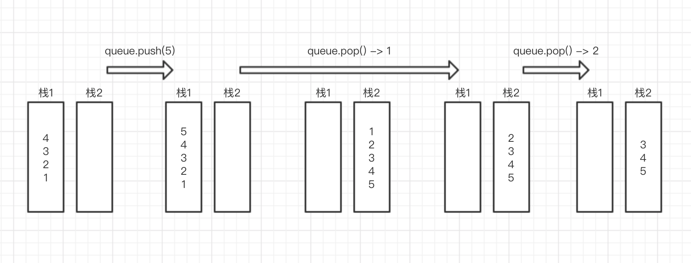

```js
const stack1 = [];
const stack2 = [];
//入栈函数
function push(node) {
    stack1.push(node);
}
//出栈函数
function pop() {
    //先判断栈2是否为空，为空的话才进栈
    if(stack2.length === 0) {
        //并且栈1的不为空，然后栈1出栈，栈2进栈
        while(stack1.length>0) {
            stack2.push(stack1.pop());
        }
    }
    //栈2出栈，如果栈2内没有元素，就直接返回null
    return stack2.pop() || null;
}
```

#### 扩展：用两个队列实现栈
思路：进栈的时候，如果队列1为空，就进入队列1，如果不为空，就把队列1中的数据灌入到队列2中，然后再把将要入栈的数据插入队列1中，
出栈的时候，如果队列1不为空，就把队列1中的数据出队，如果为空再出队列2的。
```js
const queue1 = [];
const queue2 = [];
//进栈函数
function push(x) {
    if(queue1.length === 0) {
        queue1.push(x);
        //如果queueu2不为空，就一直出队
        while(queue2.length) {
            queue1.push(queue2.shift());  //shift()是删除数组中第一个元素，并返回删除的数的值
            //将队列2删除的数给队列1
        }
    }else if(queue2.length === 0) {
        queue2.push(queue1.shift());
        while(queue1.length) {
            queue2.push(queue1.shift());
        }
    }
}
//出栈的函数
function pop() {
    if(queue1.length != 0) {
        return queue1.shift();
    } else {
        return queue2.shift();
    }
}
```

### 3.2 包含min函数的栈
思路：

*   定义两个栈，一个用来存储数据，一个用来存最小的元素。
*   首先把数据进入数据栈
*   每次进栈的时候，都将进栈的数据和最小值栈的顶元素进行比较，如果比栈顶值小就把该数加入最小值栈
*   如果比最小值栈的栈顶元素大，那就把最小值栈的栈顶元素再次（复制）插入最小值栈中。
*   在出栈的时候，需要删除最小值栈的栈顶元素，即最小值栈和数据站都应该出栈。
*   这样最小值栈的栈顶元素就永远都是当前栈的最小值

以数据[3,4,2,7,9,0]为例，让这组数字依次如栈，则栈和其对应的最小值栈如下：
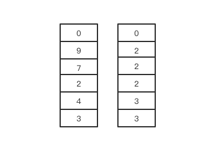

```js
//首先定义两个栈
var dataStack = [];
var minStack = [];
//进栈函数
function push(node) {
    // 首选不管怎么，数据栈都会进栈
    dataStack.push(node);
    // 如果node比最小值栈的栈顶元素小那就把node进入最小值栈，否则就把最小值栈再次（复制）再次入最小值栈
    if (minStack.length === 0 || node < min()) {
        minStack.push(node);
    }else {
        minStack(min());
    }
}
//出栈函数
// 出栈的时候数据栈出栈，最小值栈删掉栈顶元素，
function pop() {
    minStack.pop();
    return dataStack.pop();
}
// 获取最小值栈的栈顶元素
function min() {
    var length = minStack.length;
    return minStack[length - 1]&&length > 0;  //栈不空才能返回
}
```

### 3.3 滑动窗口的最大值
给定一个数组nums，有一个大小为k的滑动窗口从数组的最左侧移动到数组的最右侧，你只可以看到在滑动窗口k内的数字，滑动窗口每次向右移动一位，返回滑动窗口最大值。
```
输入: nums = [1,3,-1,-3,5,3,6,7], 和 k = 3
输出: [3,3,5,5,6,7] 
解释: 
  滑动窗口的位置                最大值
---------------               -----
[1  3  -1] -3  5  3  6  7       3
 1 [3  -1  -3] 5  3  6  7       3
 1  3 [-1  -3  5] 3  6  7       5
 1  3  -1 [-3  5  3] 6  7       5
 1  3  -1  -3 [5  3  6] 7       6
 1  3  -1  -3  5 [3  6  7]      7
```

**思路**    
使用一个双端队列（队列两面都可以进出），用于存储处于窗口中的值的下标，保证窗口头部元素永远是窗口的最大值。
遍历每个滑块的起始点。
从起始点开始，遍历后续滑块元素。
对比滑块中元素的最大值，并存入结果。

```js
var maxSlidingWindow = function(nums,k) {
    let result = [];
    for(let i=0;i<nums.length-k+1;i++) {
        let max = nums[i];
        for(let i=0;i<j+k;j++) {
            max = Math.max(max,nums[j]);
        }
        //比对完整所有元素之后，将最大值存入result
        result.push(max);
    }
    return result;
}
```

### 3.4 栈的引入和弹出，序列

[题目]
输入两个整数序列，第一个序列表示栈的压入顺序，请判断第二个序列是否为该栈的弹出顺序。
假设压入栈的所有数字均不相等。
例如序列1,2,3,4,5是某栈的压入顺序，序列4，5,3,2,1是该压栈序列对应的一个弹出序列，但4,3,5,1,2就不可能是该压栈序列的弹出序列。
（注意：这两个序列的长度是相等的）

> 题目来源：牛客网-剑指offer

思路：

*   首先判断给出的这两个栈序列是否存在并且不为空
*   然后借助一个工作站，来存放压入栈的弹出过程
*   遍历压入栈，然后依次存入工作站中
*   如果工作栈的栈顶元素和弹出栈的栈顶元素相同，工作站就出栈，并且弹出栈的索引往后移
*   如果不同就继续将压入栈元素压入工作栈继续，相当于入栈
*   最后如果工作站为空就说明第二个序列是第一个序列的弹出顺序


```js
//传入两个栈序列，一个是压入栈，一个是弹出栈
function IsPopOrder(pushV,popV) {
    //首先判断这两个栈是否存在并且不为空
    if(pushV || popV || pushV.length === 0 || popV.length === 0 ) {
        return;
    } 
    var workStack = [];  //定义一个工作栈
    var outIndex = 0;  //在弹出栈中移动的索引
    for(var i=0;i<pushV.length;i++) {
        // 从栈底开始把压入栈的元素放入工作栈中
        workStack.push(pushV[i])
        //工作栈栈顶元素和弹出栈索引位置相同的话，工作站出栈，并且索引后进一位
        while(workStack.length && workStack[workStack.length - 1] === popV[outIndex]) {
            workStack.pop();
            outIndex ++;
        }
    }
    // 如果工作栈最后为空，说明弹出栈就是压入栈的出栈序列
    return workStack.length === 0;
}
```

## 4.链表
链表与数组不同，链表中的元素在内存中不必是连续的内存空间。  
链表的每个元素由一个存储元素本身的节点和一个指向下一个元素的引用组成。

相对于数组，链表有一些优点：
- 内存空间不是必须连续的，可以充分利用计算机的内存，实现灵活的内存动态管理。
- 链表不必在创建时确定大小，并且大小可以无限的延伸下去。
- 链表在插入和删除数据时，时间复杂度可以达到O(1),相对数组效率高很多。

相对于数组，链表的缺点：
- 链表访问任何一个位置的元素时，都需要从头开始访问。
- 无法通过下标直接访问元素，需要从头一个个访问，直到找到对应元素。

### 4.1 链表的定义（单向链表）
链表和数组一样，可以用于存储一系列的元素，但是链表和数组的实现机制完全不同。链表的每个元素由一个存储元素本身的节点和一个指向下一个元素的引用（有的语言称为指针或连接）组成。类似于火车头，一节车厢载着乘客（数据），通过节点连接另一节车厢。
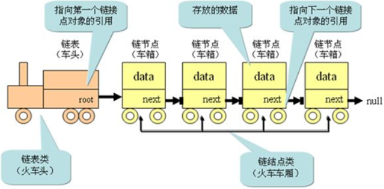

head属性指向链表的第一个节点；  
链表中的最后一个节点指向null；  
当链表中一个节点也没有的时候，head直接指向null；


### 4.2 单向链表的封装

```js
function LinkedList() {
    //内部的类：节点类
    function Node(data) {
        this.data = data;
        this.next = null;
    }
    //属性
    this.head = null;
    this.length = 0;
}
```

### 4.3 链表中常见方法

- append（element）：向链表尾部添加一个新的项；
- insert（position，element）：向链表的特定位置插入一个新的项；
- get（position）：获取对应位置的元素；
- indexOf（element）：返回元素在链表中的索引。如果链表中没有该元素就返回-1；
- update（position，element）：修改某个位置的元素；
- removeAt（position）：从链表的特定位置移除一项；
- remove（element）：从链表中移除一项；
- isEmpty（）：如果链表中不包含任何元素，返回trun，如果链表长度大于0则返回false；
- size（）：返回链表包含的元素个数，与数组的length属性类似；
- toString（）：由于链表项使用了Node类，就需要重写继承自JavaScript对象默认的toString方法，让其只输出元素的值；

#### 4.3.1 append()
```js
LinkedList.prototype.append = data => {
        //1.创建新的节点
        let newNode = new Node(data);

        // 2.判断添加的是否是第一个节点
        if(this.length == 0) {  //2.1 是第一个节点
            this.head = newNode;
        }else {  //2.2 不是第一个节点
            let current = this.head;
            //找到最后一个节点
            while(current.next) {
                current = current.next;
            }
            //最后节点的next指向新的节点
            current.next = newNode;
        }
        //3.lenght+1
        this.length += 1;
    }
```
**过程：**
- 首先链表是否为空，如果为空直接把新的节点插到头结点后面。
- 让current节点指向头结点


- 通过while循环使current遍历到最后一个节点，最后让最后一个节点指向新节点newNode：
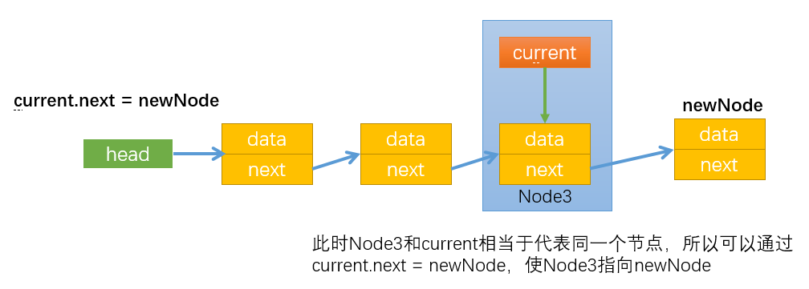

**测试：**
```js
let list = new LinkedList();
list.append('123');
list.append('234');
list.append('345');
console.log(list);
```

结果：


#### 4.3.2 toString()

```js
 LinkedList.prototype.toString = () => {
        //定义变量
        let current = this.head;
        let listString = "";
        while(current) {
            listString += current.data + " ";
            current = current.next;
        }
        return listString;
    }

// 测试：
console.log(list.toString());  //123 234 345 
```

#### 4.3.3 insert()
```js
LinkedList.prototype.insert = (position,data) => {
        //1.对position进行跨界判断
        if(position < 0 || position > this.length) {
            return false;
        }
        // 根据datac创建Node
        let newNode = new Node(data);

        ////判断插入的位置
        if(position == 0) {
            newNode.next = this.head;
            this.head = newNode;          
        }else{
            let index = 0;
            let current = this.head;
            let previous = null;
            while(index < position) {
                previous = current;
                current = current.next;
                index += 1;
            }
            newNode.next = current;
            previous.next = newNode;
        }
        this.length += 1;
        return true;
    }
```

**过程：**
inset方法实现的过程：根据插入节点位置的不同可分为多种情况：
- 情况一：position=0    

通过： newNode.next = this.head，建立连接1；    
通过： this.head = newNode，建立连接2；（不能先建立连接2，否则this.head不再指向Node1）


- 情况二：position>0 || position < length

首先定义两个变量previous和curent分别指向需要插入位置pos = X的前一个节点和后一个节点；       
然后，通过：newNode.next = current，改变指向3；     
最后，通过：previous.next = newNode，改变指向4；

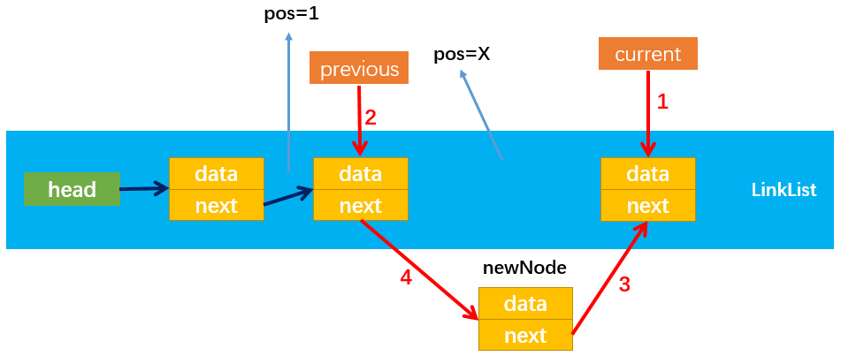

- 情况三：position = length
情况2也包含了pos = length的情况，该情况下current和newNode.next都指向null；建立连接3和连接4的方式与情况2相同。


**测试：**
```js
list.insert(0,"000")
console.log(list.toString());  //000 123 234 345 
list.insert(2,"111");
console.log(list.toString());  //000 123 111 234 345 
list.insert(list.length,'333');
console.log(list.toString());  //000 123 111 234 345 333 
```

#### 4.3.4 get(position)
```js

LinkedList.prototype.get = (position) => {
        if(position < 0 || position >= this.length) {
            return null;
        }
        // 获取对应的data
        let current = this.head;
        let index = 0;
        while(index < position) {
            current = current.next;
            index += 1;
        }
        return current.data;
    }
}
```
测试get()方法：
```js
// 测试get方法
console.log(list.get(1));  //123
```

#### 4.3.5 indexOf()方法
```js
LinkedList.prototype.indexOf = (str) => {
        let current = this.head;
        let index = 0;
        while(current.data !== str && index < this.length){
            current = current.next;
            index += 1;
        }
        return index;
    }

// 测试indexOf()
console.log(list.indexOf('333')); //5
```

#### 4.3.6 updata()方法
```js
 LinkedList.prototype.updata = (position,newData) => {
        if(position < 0 || position > this.length) {
            return  false;
        }
        let current = this.head;
        let index = 0;
        while(index++ < position) {
            current = current.next;
        }
        //将position位置的data修改成newData
        current.data = newData;
        return true;
    }

//测试updata()
list.updata(2,"new222");
console.log(list.toString());  //000 123 new222 234 345 333 
```

#### 4.3.7 removeAt()方法

```js
LinkedList.prototype.removeAt = position => {
        if(position < 0 || position >= this.length) {
            return null;
        }
        let current = this.head;
        let index = 0;
        if(position == 0) {  //如果删除第一个元素，就直接把头指针指向下一个元素即可
            this.head = this.head.next;
        }else {
            let previous = null;
            while (index++ < position) {
                previous = current
                current = current.next
              }
            //循环结束后，current指向position后一个节点，previous指向current前一个节点
            //再使前一个节点的next指向current的next即可
            previous.next = current.next
        }
        this.length -- ;
        // 返回删除的节点数据
        return current.data;
    }

//测试removeAt(position)
list.removeAt(2);
console.log(list.toString());
//000 123 234 345 333 
```
removeAt方法的实现过程：删除节点时存在多种情况：

- 情况1：position = 0，即移除第一个节点（Node1）。

通过：this.head = this.head.next，改变指向1即可；

虽然Node1的next仍指向Node2，但是没有引用指向Node1，则Node1会被垃圾回收器自动回收，所以不用处理Node1指向Node2的引用next。

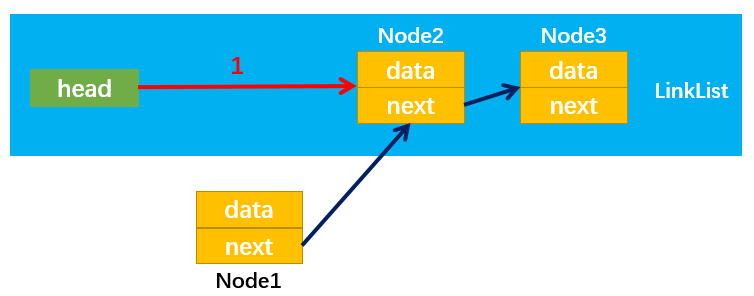

- 情况2：positon > 0，比如pos = 2即移除第三个节点（Node3）。

注意：position = length时position后一个节点为null不能删除，因此position != length；

首先，定义两个变量previous和curent分别指向需要删除位置pos = x的前一个节点和后一个节点；

然后，通过：`previous.next = current.next`，改变指向即可；

随后，没有引用指向Node3，Node3就会被自动回收，至此成功删除Node3 。

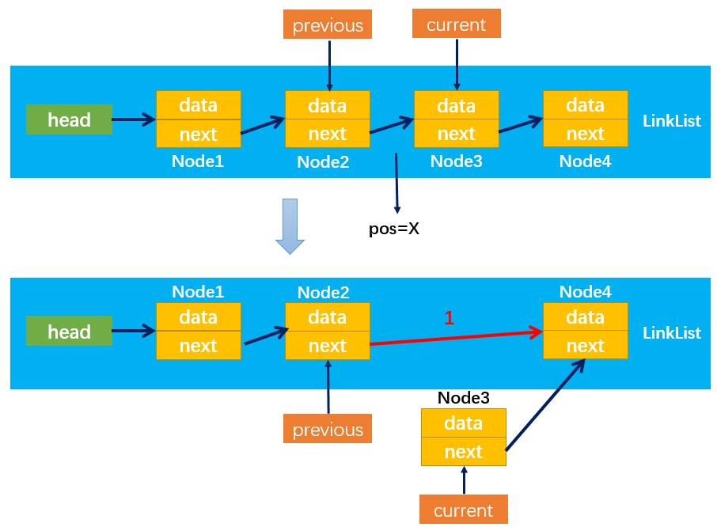

#### 4.3.8 其他方法
```js
      //一.实现remove方法
      LinkList.prototype.remove = (data) => {
        //1.获取data在列表中的位置
        let position = this.indexOf(data)
        //2.根据位置信息，删除结点
        return this.removeAt(position)
      }

      //二.实现isEmpty方法
      LinkList.prototype.isEmpty = () => {
        return this.length == 0
      }

      //三.实现size方法
      LinkList.prototype.size = () => {
        return this.length
      }
```

## 4.双向链表

**双向链表：**既可以**从头遍历到尾**，又可以**从尾遍历到头**。也就是说链表连接的过程是双向的，它的实现原理是：一个节点既有向前连接的引用，也有一个向后连接的引用。
**双向链表的缺点**：
- 每次在插入或删除某个节点时，都需要处理四个引用，而不是两个，实现起来会困难些；
- 相对于单向链表，所占内存空间更大一些；
- 但是，相对于双向链表的便利性而言，这些缺点微不足道。

**双向链表的结构：**


- 双向链表不仅有head指针指向第一个节点，而且有tail指针指向最后一个节点；
- 每一个节点由三部分组成：item储存数据、prev指向前一个节点、next指向后一个节点；
- 双向链表的第一个节点的prev指向null；
- 双向链表的最后一个节点的next指向null；

### 4.1 双向链表常见的操作（方法）

- append（element）：向链表尾部添加一个新的项；
- inset（position，element）：向链表的特定位置插入一个新的项；
- get（element）：获取对应位置的元素；
- indexOf（element）：返回元素在链表中的索引，如果链表中没有元素就返回-1；
- update（position，element）：修改某个位置的元素；
- removeAt（position）：从链表的特定位置移除一项；
- isEmpty（）：如果链表中不包含任何元素，返回trun，如果链表长度大于0则返回false；
- size（）：返回链表包含的元素个数，与数组的length属性类似；
- toString（）：由于链表项使用了Node类，就需要重写继承自JavaScript对象默认的toString方法，让其只输出元素的值；
- forwardString（）：返回正向遍历节点字符串形式；
- backwordString（）：返回反向遍历的节点的字符串形式；

### 4.2 双向链表的封装

```js
function DoublyLinkedList() {

    // 内部类
    function Node(data) {
        this.data = data;
        this.prev = null;
        this.next = null;
    }
    // 属性
    this.head = null;
    this.tail = null;
    this.length = 0;
}
```

#### 4.2.1 append()方法

```js
DoubleLinklist.prototype.aapend(data) {
        //1.创建一个新的节点
        let newNode = new Node(data);
        
        //2。添加节点
        //2.1如果是第一个节点
        if(this.length === 0) {
            this.head = newNode;
            this.tail = newNode;
        }else {
            //2.2如果不是第一个节点
            let current = this.head;

            while(current.next !== null) {
                current = current.next;
            }
            newNode.next =  this.tail.next;
            this.tail.next = newNode;
            newNode.prev = this.tail;
        }
        //3.改变链表的length
        this.length += 1;
    }
```
过程分析：
添加的节点需要考虑多种情况：
- 情况1：添加的是第一个节点：只需要让head和tail都指向新节点即可；

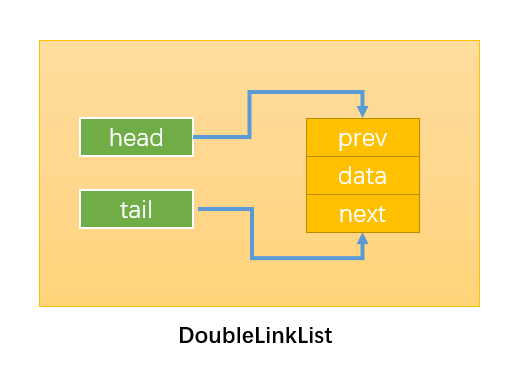

- 情况2：添加的不是第一个节点，如下图所示：只需要改变相关引用的指向即可。

* 通过：`newNode.prev = this.tail`：建立指向1；
* 通过：`this.tail.next = newNode`：建立指向2；
* 通过：`this.tail = newNode`：建立指向3  
要注意改变变量指向的顺序，最后修改tail指向，这样未修改前tail始终指向原链表的最后一个节点。


测试：
```js
let list = new DoubleLinklist();
list.append('111');
list.append('222');
list.append('333');
console.log(list);
```
#### 4.2.2 转成字符串方法
```js
// 转成字符串形似方法
    DoubleLinklist.prototype.toString = () => {
        //因为toString方法一般都是从头开始遍历，所以直接调用forwardString方法即可
        return this.backwardString();

    }
    //forwardString方法 向前遍历
    DoubleLinklist.prototype.forwardString = () => {
        let retString = ''
        let current = this.tail;

        if(this.length === 0) {
            return null;
        }
        while(current) {
            retString += current.data + ' ';
            current = current.prev;
        }
        return retString;
    }
    //backwardString方法 向后遍历
    DoubleLinklist.prototype.backwardString = () => {
        let current = this.head;
        let retString = '';  
        
        if(this.length === 0) {
            return null;
        }
        
        while(current) {
            retString += current.data + ' ';
            current = current.next;
        }
        return retString;
    }
```
测试：
```js
console.log(list.toString());  //111 222 333 
console.log(list.forwardString());  //333 222 111 
console.log(list.backwardString()); //111 222 333 
```
#### 4.2.3 插入方法 insert

```js
DoubleLinklist.prototype.insert = (position,data) => {
        //跨界判断
        if(position < 0 || position > this.length) {
            return false;
        }
        //插入新节点
        let newNode = new Node(data);
        //1.如果插入的节点在表头
        if(this.length == 0) {
            this.head = newNode;
            this.tail = newNode;
            //2.插入表末尾
        } else if (position == this.length) {
            this.tail.next = newNode;
            newNode.prev = this.tail;
            this.tail = newNode;
        } else { //3.插入表中间
            let current = this.head;
            let index = 0;

            while(index++ < position) {
                current = current.next;
            }
            newNode.prev = current.prev;
            current.prev.next = newNode;
            current.prev = newNode;
            newNode.next = current;
        }
    }
```

过程分析：
插入节点可分为多种情况：

**当原链表为空时：**

- 情况1：插入的新节点是链表的第一个节点；只需要让head和tail都指向newNode即可。

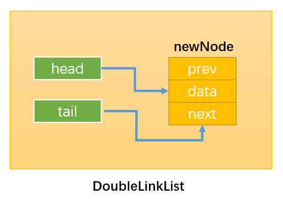

**当原链表不为空时：**

- 情况2：当position == 0，即在链表的首部添加节点：如下图所示：


首先，通过：`this.head.prev = newNode`，改变指向1；

然后，通过：`newNode.next = this.head`，改变指向2；

最后，通过：`this.head = newNode`，改变指向3；

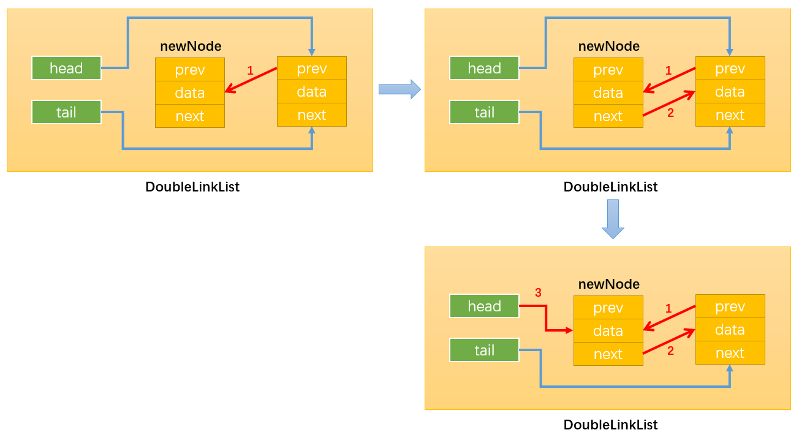

- 情况3：`position == this.length`，即在链表的尾部添加节点，如下图所示：

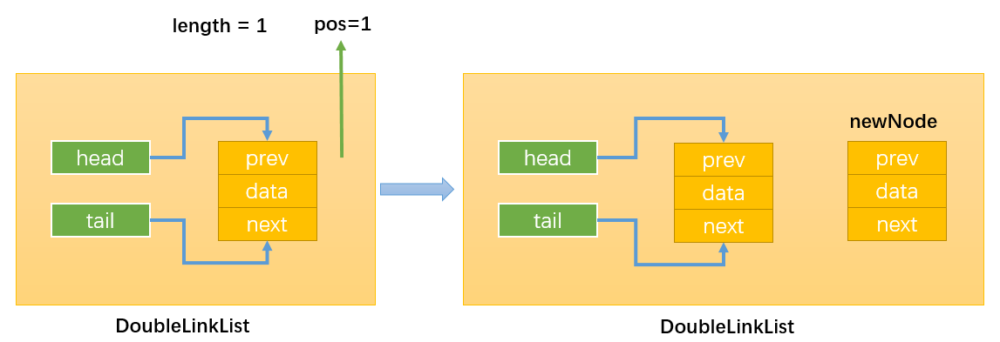

首先，通过：`this.tail.next = newNode`，改变指向1；（注意这里使用this.tail指向原链表最后一个节点，而不是`this.head`。因为当`length>1`时，`this.head != this.tail`。）

然后，通过：`newNode.prev = this.tail`，改变指向2；

最后，通过：`this.tail = newNode`，改变指向3；

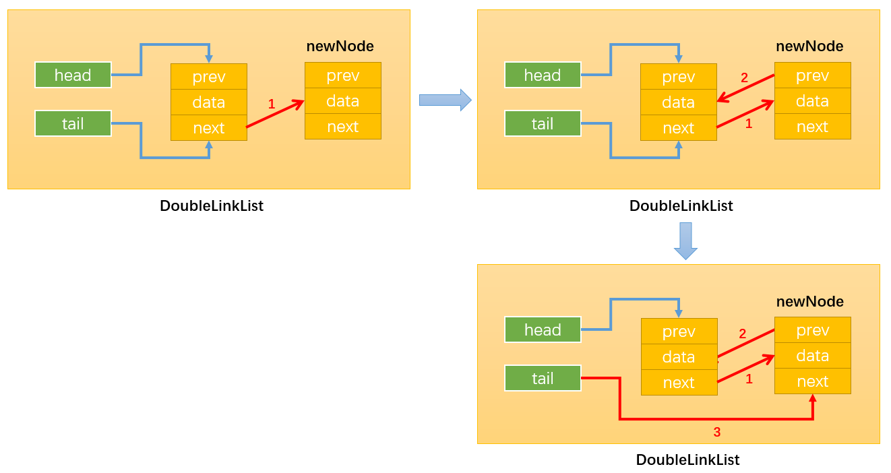

- 情况4：0 < position < this.length，即在链表的中间插入新节点，假设在position = 1的位置插入，如下图所示：

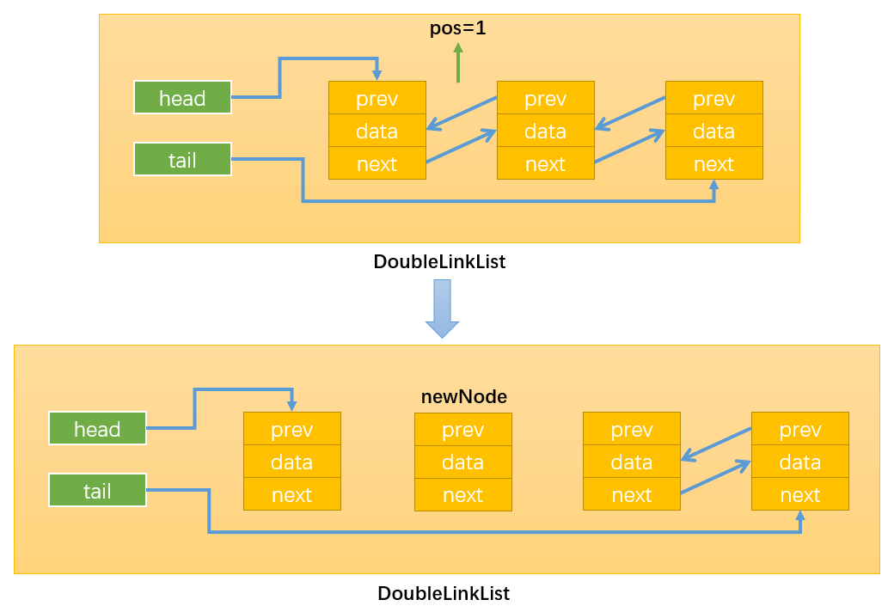

首先，需要定义变量current按照之前的思路，通过while循环找到position位置的后一个节点，循环结束后`index = position`

如下图所示：当position = 1时，current就指向了Node2。这样操作current就等同于间接地操作Node2，还可以通过current.prev间接获取Node1。得到了newNode的前一个节点和后一个节点就可以通过改变它们的prev和next变量的指向来插入newNode了。

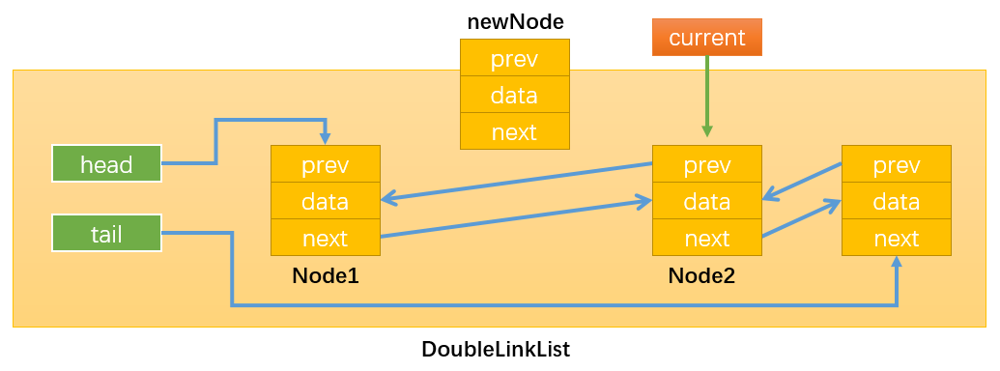

通过：`newNode.next = current`，改变指向1；

通过：`newNode.prev = current.prev`，改变指向2；

通过：`current.prev.next = newNode`，改变指向3；

注意必须最后才修改`current.prev`的指向，不然就无法通过`current.prev`获取需要操作的Node1了。

通过：`current.prev = current`，改变指向4；

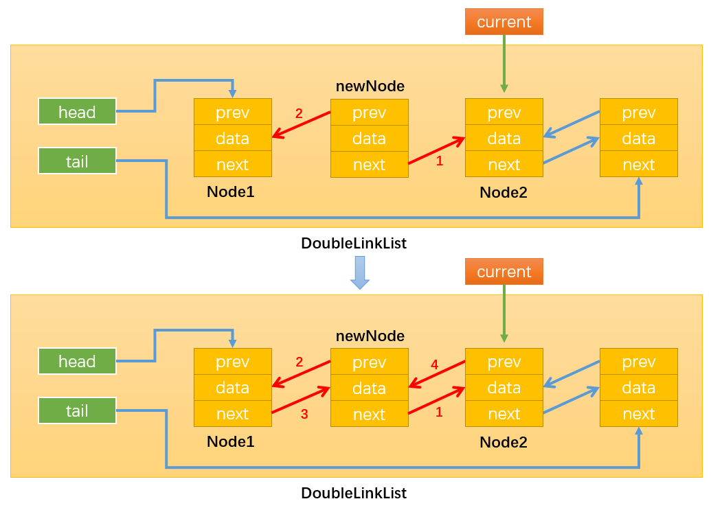

**测试：**
```js
list.insert(2,'00000');
list.insert(0,'插在链表的头部');
list.insert(list.length,'插在链表的尾部');
console.log(list.toString());

```

`**结果：**`        
`插在链表的头部 111 222 00000 333 插在链表的尾部 `

#### 4.2.4 get(position)
```js
DoubleLinklist.prototype.get = (position) => {
        //越界判断
        if(position < 0 || position >= this.length) {
            return null;
        }
        //获取元素
        let current = this.head;
        let index = 0;
        while(index < position) {
            current = current.next;
            index ++;
        }
        return current.data;
    }
```
测试：
```
console.log(list.get(3));  //00000
```

#### 4.2.5 indexOf方法实现
```js
DoubleLinklist.prototype.indexOf = (data) => {
        let current = this.head;
        let index = 0;

        while(current) {
            if(current.data === data) {
                return index;
            }
            current = current.next;
            index ++;
        }
        return -1;  //找不到
    }
```
测试：
```js
console.log(list.indexOf('00000'));  //3
```

#### 4.2.6 update(position,element)
```js
DoubleLinklist.prototype.updata = (position,newData) => {
        //越界判断
        if(position < 0 || position >= this.length) {
            return false;
        }
        let current = this.head;
        let index = 0;
        while(index < position) {
            current = current.next;
            index ++;
        }
        current.data = newData;
        return true;
    }
```
测试：
```js
list.updata(3,'aaa');
console.log(list.toString()); 
//插在链表的头部 111 222 00000 333 插在链表的尾部 
```

#### 4.2.7 removeAt(position)
```js
DoubleLinklist.prototype.removeAt = (position) => {
        //越界判断
        if(position < 0 || position > this.length) {
            return null;
        }
        let current = this.head; 
        //链表中只有一个元素
        if(this.length === 0) {
            this.head = null;
            this.tail = null;
        }else {
            //判断是否删除的是第一个元素
            if(position == 0) {
                this.head.next.prev = null;
                this.head = this.head.next;
            }else if(position == this.length - 1){  //删除最后一个节点
                current = this.tail;  //接受被返回的删除的节点
                this.tail.prev.next = null;
                this.tail = current.prev;
            } else { //删除中间的节点
                let index = 0;
                while(index < position) {
                    current = current.next;
                    index += 1;
                }
                current.prev.next = current.next;
                current.next.prev = current.prev;
            }
        }
        this.length --;
        return current.data;
    }
```

**过程详解：**

删除节点时有多种情况：

**当链表的length = 1时:**

- 情况1：删除链表中的所有节点：只需要让链表的head和tail指向null即可。

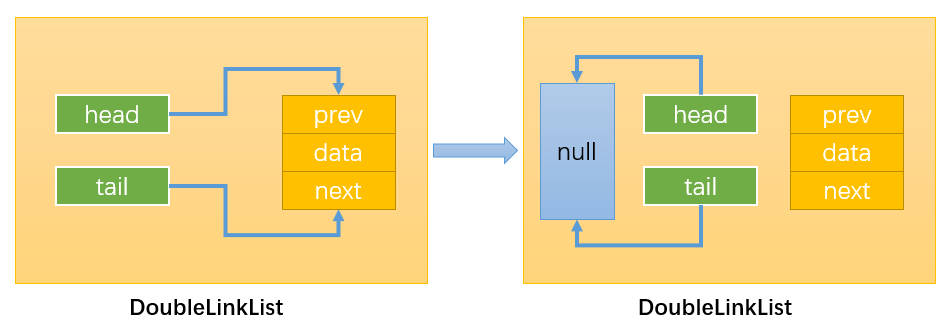

**当链表的length > 1时：**

- 情况2：删除链表中的第一个节点：

通过：`this.head.next.prev = null`，改变指向1；

通过：`this.head = this.head.next`，改变指向2；

虽然Node1有引用指向其它节点，但是没有引用指向Node1，那么Node1会被自动回收。

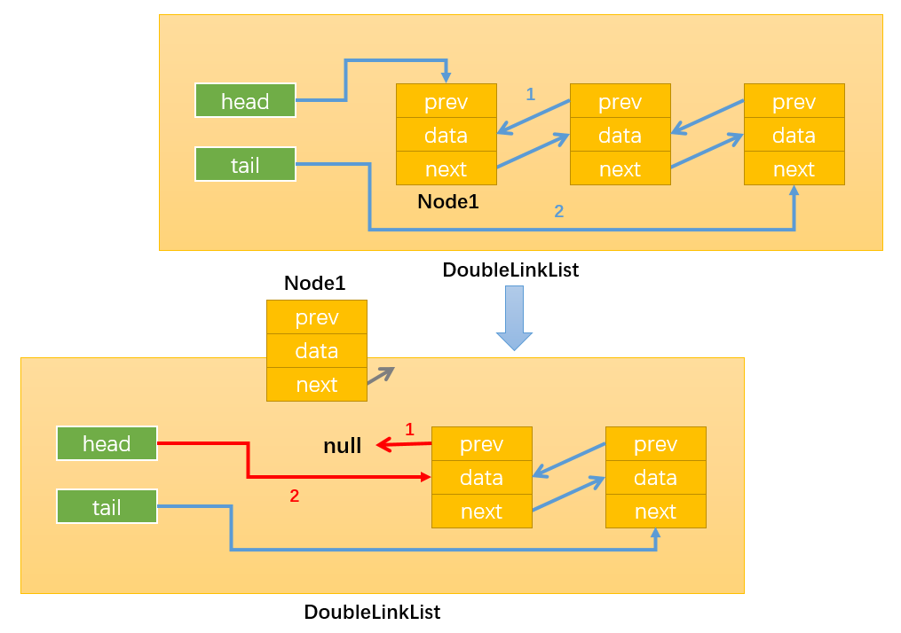

- 情况3：删除链表中的最后一个节点：

通过：`this.tail.prev.next = null`，修改指向1；

通过：`this.tail = this.tail.prev`，修改指向2；

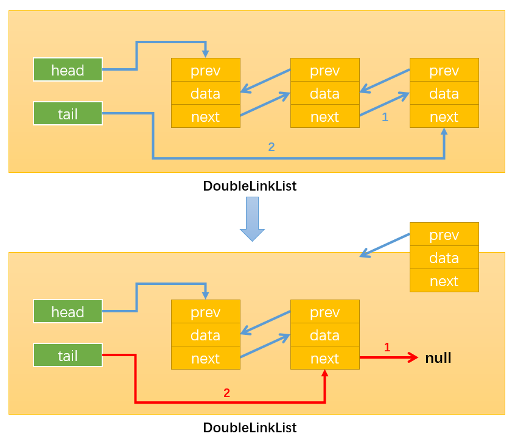

- 情况4：删除链表中间的节点：

通过while循环找到需要删除的节点，比如position = x，那么需要删除的节点就是Node(x+1)，如下图所示：

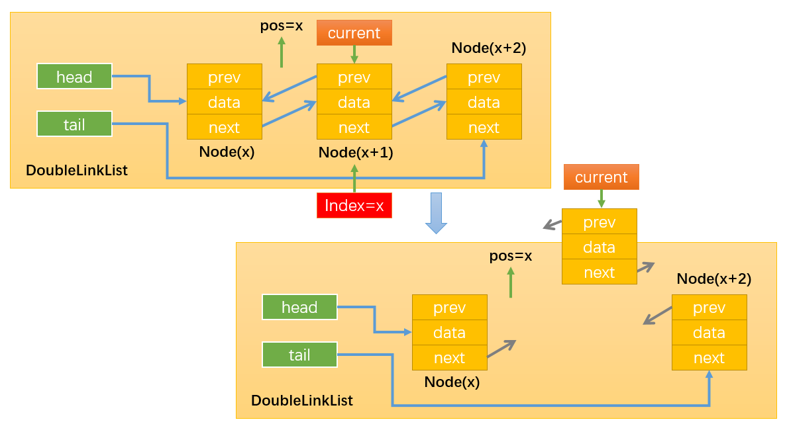

通过：`current.next.prev = current.prev`，修改指向1；

通过：`current.prev.next = current.next`，修改指向2；

这样就没有引用指向Node(x+1)了（current虽指向Node(x+1)，但current时临时变量，该方法执行完就会被销毁），随后Node(x+1)就会被自动删除。

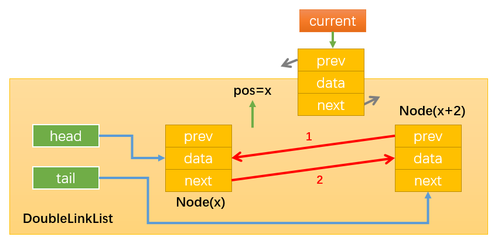

**测试**

```js
let re = list.removeAt(3);
console.log("删除的节点是：" + re);
console.log(list.toString());
// 删除的节点是：00000
//插在链表的头部 111 222 333 插在链表的尾部 
```

#### 4.2.8 其他方法
其他方法包括：remove(element)、isEmpty()、size()、getHead()、getTail()

```js

    //remove()
    DoubleLinklist.prototype.remove = () =>  {
        //找到data的索引
        let index = this.indexOf(data);

        //删除这个索引位置对应的元素
        this.removeAt(index);

        return index;
    }

    //isEmpty()
    DoubleLinklist.prototype.isEmpty = () => {
        return this.length === 0;
    }
    //size()
    DoubleLinklist.prototype.size = () => {
         return this.length;
    }
    //getHead()
    DoubleLinklist.prototype.getHead = () => {
        return this.head.data;
    }
    //getTail() 
    DoubleLinklist.prototype.getTail = () => {
        return this.tail.data;
    }
```

## 5.集合结构
几乎每种编程语言中，都有集合结构。集合比较常见的实现方式是哈希表，这里使用 JavaScript 的 Object 进行封装。

### 5.1 集合的特点
- 集合通常是由一组无序的、不能重复的元素构成。

- 数学中常指的集合中的元素是可以重复的，但是计算机中集合的元素不能重复。
- 集合是特殊的数组。

    * 特殊之处在于里面的元素没有顺序，也不能重复。
    * 没有顺序意味着不能通过下标值进行访问，不能重复意味着相同的对象在集合中只会存在一份。

### 5.2 封装集合
ES6 中的 Set 就是一个集合类，这里我们重新封装一个 Set 类，了解集合的底层实现。

#### 5.2.1 集合常见的操作
- `add(value) `向集合添加一个新的项。
- `remove(value`) 从集合移除一个值。
- `has(value) `如果值在集合中，返回 true，否则返回 false。
- `clear()` 移除集合中的所有项。
- `size() `返回集合所包含元素的数量。与数组的 length 属性类似。
- `values() `返回一个包含集合中所有值的数组。
还有其他的方法，用的不多，这里不做封装。

#### 5.2.2 集合封装代码实现
```js
//集合结构的封装
class Set {
    constructor() {
        this.items = [];
    }

    //has(value)判断集合中是否存在value这个属性，存在返回true，否则返回false
    has(value) {
        return this.items.hasOwnProperty(value); //hasOwnProperty检测一个属性是否是自身的属性而不是原型的属性
    };

    //add(value) 往集合中添加value
    add(value) {
        // 首先检测集合中是否包含这个属性（值）
        if(this.has(value)) {
            return false;
        }
        this.items[value] = value; //属性名和值都是value
        return true;
    }

    //remove(value) 删除集合中指定的value
    remove(value) {
        //如果集合中不存在这个value，则范湖false
        if(!this.has(value)) {
            return false;
        }
        delete this.items[value];
    }

    //clear()情况所有的value
    clear() {
        this.items = {};
    }

    //size() 返回集合中value的个数
    size() {
        return Object.keys(this.items).length;
    }

    //values() 获取集合中所有的value
    values() {
        return Object.keys(this.items);
    }
}
```

**代码测试：**
```js
const set = new Set();
// add()测试
set.add('111');
set.add('222');
set.add('333');
set.add('444');

//values()测试
console.log(set.values());  //[ '111', '222', '333', '444' ]

//has()测试
console.log(set.has('222')); //true
console.log(set.has('000'));  //false

// size()和remove()测试
console.log(set.size());  //4
set.remove('222');
console.log(set.size());  //3
console.log(set.values());  //[ '111', '333', '444' ]

//clear()测试
set.clear()
console.log(set.values());  // []
```

### 5.3 集合间的操作
- 并集：对于给定的两个集合，返回一个包含两个集合中所有元素的新集合。
- 交集：对于给定的两个集合，返回一个包含两个集合中共有元素的新集合。
- 差集：对于给定的两个集合，返回一个包含所有存在于第一个集合且不存在于第二个集合的元素的新集合。
- 子集：验证一个给定集合是否是另一个集合的子集。


#### 5.3.1 集合并集的实现
- 并集的实现
```js
    union(otherSet) {
        //1.创建一个新的集合
        let newSet = new Set();

        //2.将当前集合的value添加到新集合newSet中
        for(let value of this.values()) {
            newSet.add(value);
        } 

        //3.将otherSet集合中的所有value，添加到新集合newSet中
        for(let value of otherSet.values()) {
            newSet.add(value);  //这里add已经有重复判断了
        }
        return  newSet;
    }
```

- 交集实现
```js
    intersection(otherSet) {
        //创建一个新的集合
        let newSet = new Set();

        //从当前集合中选出每个元素都判断在otherSet中是否存在
        for(let value of this.values()) {
            if(otherSet.has(value)) {
                newSet.add(value);
            }
        }
        return newSet;
    }
```
- 差集实现
```js
    difference(otherSet) {
        //创建一个新集合
        let newSet = new Set();

        //从当前集合中取出每一个value，判断是否在otherSet集合中存在，不存在的就是差集
        for(let value of this.values()) {
            if(!otherSet.has(value)) {
                newSet.add(value);
            }
        }
        return newSet;
    }
```

- 子集的实现

```js
    subset(otherSet) {
        //从当前集合中取出每一个value判断是否在otherSet集合中存在，有不存在的返回false
        //如果能遍历完所有的，说明就是自己，返回true
        for(let value of this.values()) {
            if(!otherSet.has(value)) {
                return false;
            }
            return true;
        }
    }
```

**测试：**
```js
set = ['111','222','333','444']
otherSet = ['aaa','bbb','ccc','222']

console.log(set.union(otherSet).values()); 
//  ["111", "222", "333", "444", "aaa", "bbb", "ccc"]

console.log(set.intersection(otherSet).values());  //["333"]

console.log(set.difference(otherSet).values());  //["111", "222", "444"]

console.log(set.subset(otherSet));  //false
```

## 6.集合
**字典的特点：**
- 字典存储的是**键值对**，主要的特点是一一对应
- 比如保存个人信息
    * 数组形式：`['11','hello','20']`
    * 字典形式：{"age":20,"name":"kendy",height:120},可以通过key取出value。

**字典与映射的关系**
- 有些编程语言称这种映射关系为字典，比如Python中的dict,Swift中的 Dictonary。
- 有些编程语言中称这种映射关系为 Map，比如 Java 中的 HashMap 和 TreeMap 等。

**字典常见的操作**
- set(key,value) 向字典中添加新元素。
- remove(key) 通过使用键值来从字典中移除键值对应的数据值。
- has(key) 如果某个键值存在于这个字典中，则返回 true，反之则返回 false。
- get(key) 通过键值查找特定的数值并返回。
- clear() 将这个字典中的所有元素全部删除。
- size() 返回字典所包含元素的数量。与数组的 length 属性类似。
- keys() 将字典所包含的所有键名以数组形式返回。
- values() 将字典所包含的所有数值以数组形式返回。

**字典的封装**
```js
//封装字典类
function Dictionary(){
  //字典属性
  this.items = {}

  //字典操作方法
  //一.在字典中添加键值对
  Dictionary.prototype.set = function(key, value){
    this.items[key] = value
  }

  //二.判断字典中是否有某个key
  Dictionary.prototype.has = function(key){
    return this.items.hasOwnProperty(key)
  }

  //三.从字典中移除元素
  Dictionary.prototype.remove = function(key){
    //1.判断字典中是否有这个key
    if(!this.has(key)) return false

    //2.从字典中删除key
    delete this.items[key]
    return true
  }

  //四.根据key获取value
  Dictionary.prototype.get = function(key){
    return this.has(key) ? this.items[key] : undefined
  }

  //五.获取所有keys
  Dictionary.prototype.keys = function(){
    return Object.keys(this.items)
  }

  //六.size方法
  Dictionary.prototype.keys = function(){
    return this.keys().length
  }

  //七.clear方法
  Dictionary.prototype.clear = function(){
    this.items = {}
  }
}

```

## 7.哈希表

### 7.1 认识哈希表
哈希表是一种非常重要的数据结构，几乎所有的编程语言都直接或者间接应用这种数据结构。

哈希表通常是基于数组实现的，但是相对于数组，它存在更多优势：

- 哈希表可以提供非常快速的插入-删除-查找操作。
- 无论多少数据，插入和删除值都只需接近常量的时间，即 O(1) 的时- 间复杂度。实际上，只需要几个机器指令即可完成。
- 哈希表的速度比树还要快，基本可以瞬间查找到想要的元素。
- 哈希表相对于树来说编码要简单得多。

哈希表同样存在不足之处：

- 哈希表中的数据是没有顺序的，所以不能以一种固定的方式（比如从小到大 ）来遍历其中的元素。
- 通常情况下，哈希表中的 key 是不允许重复的，不能放置相同的 key，用于保存不同的元素。

**哈希表是什么？**

- 哈希表并不好理解，不像数组、链表和树等可通过图形的形式表示其结构和原理。
- 哈希表的结构就是数组，但它神奇之处在于对下标值的一种变换，这种变换我们可以称之为哈希函数，通过哈希函数可以获取 HashCode。

**通过以下案例了解哈希表：**

    * 案例一：公司想要存储 1000 个人的信息，每一个工号对应一个员工的信息。若使用数组，增删数据时比较麻烦；使用链表，获取数据时比较麻烦。有没有一种数据结构，能把某一员工的姓名转换为它对应的工号，再根据工号查找该员工的完整信息呢？没错此时就可以使用哈希表的哈希函数来实现。

    * 案例二：存储联系人和对应的电话号码：当要查找张三（比如）的号码时，若使用数组：由于不知道存储张三数据对象的下标值，所以查找起来十分麻烦，使用链表时也同样麻烦。而使用哈希表就能通过哈希函数把张三这个名称转换为它对应的下标值，再通过下标值查找效率就非常高了。

也就是说：哈希表最后还是基于数据来实现的，只不过哈希表能够通过哈希函数把字符串转化为对应的下标值，建立字符串和下标值的映射关系。

### 7.2 哈希化的方式

为了把字符串转化为对应的下标值，需要有一套编码系统，为了方便理解我们创建这样一套编码系统：比如a为1，b为2，c为3，以此类推z为26，空格为0，总共27个字符（不考虑大写情况）。

有了编码系统后，将字母转化为数字也有很多种方式：

- 方式一：数字相加。例如cats转化为数字：3+1+20+19=43，那么就把43作为cats单词的下标值储存在数组中；

但是这种方式会存在这样的问题：很多的单词按照该方式转化为数字后都是43，比如was/tin。而在数组中一个下标值只能储存一个数据，所以该方式不合理。

- 方式二：幂的连乘。我们平时使用的大于10的数字，就是用幂的连乘来表示它的唯一性的。比如： 6543=6 * 10^3^ + 5 * 10^2^ + 4 * 10 + 3；这样单词也可以用该种方式来表示：cats = 3 * 27^3^ + 1 * 27^2^ + 20 * 27 + 17 =60337;

虽然该方式可以保证字符的唯一性，但是如果是较长的字符（如aaaaaaaaaa）所表示的数字就非常大，此时要求很大容量的数组，然而其中却有许多下标值指向的是无效的数据（比如不存在zxcvvv这样的单词），造成了数组空间的浪费。

两种方案总结：

- 第一种方案（让数字相加求和）产生的数组下标太少；
- 第二种方案（与27的幂相乘求和）产生的数组下标又太多；
现在需要一种压缩方法，把幂的连乘方案系统中得到的巨大整数范围压缩到可接受的数组范围中。可以通过取余操作来实现。虽然取余操作得到的结构也有可能重复，但是可以通过其他方式解决。

哈希表的一些概念：

哈希化：将大数字转化成数组范围内下标的过程，称之为哈希化；
哈希函数：我们通常会将单词转化成大数字，把大数字进行哈希化的代码实现放在一个函数中，该函数就称为哈希函数；
哈希表：对最终数据插入的数组进行整个结构的封装，得到的就是哈希表。
仍然需要解决的问题：

哈希化过后的下标依然可能重复，如何解决这个问题呢？这种情况称为冲突，冲突是不可避免的，我们只能解决冲突

### 7.3 解决冲突的方法
解决冲突常见的两种方案：

#### 7.3.1 链地址法（拉链法）；

如下图所示，我们将每一个数字都对10进行取余操作，则余数的范围0~9作为数组的下标值。并且，数组每一个下标值对应的位置存储的不再是一个数字了，而是存储由经过取余操作后得到相同余数的数字组成的数组或链表。

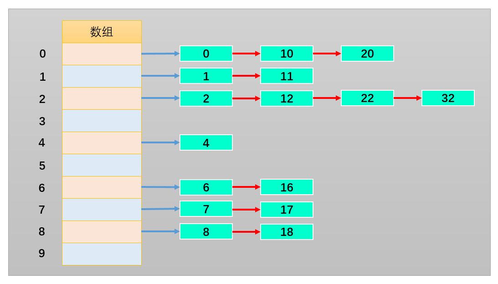

- 这样可以根据下标值获取到整个数组或链表，之后继续在数组或链表中查找就可以了。而且，产生冲突的元素一般不会太多。

**总结：** 链地址法解决冲突的办法是每个数组单元中存储的不再是单个数据，而是一条链条，这条链条常使用的数据结构为数组或链表，两种数据结构查找的效率相当（因为链条的元素一般不会太多）。

#### 7.3.2 开放地址法；

开放地址法的主要工作方式是寻找空白的单元格来放置冲突的数据项。


根据探测空白单元格位置方式的不同，可分为三种方法：

* 线性探测  
* 二次探测
* 再哈希法

#### 7.3.3 寻找空白单元格的方式

**线性探测**

**当插入 13 时：**

经过哈希化（对 10 取余）之后得到的下标值 index=3，但是该位置已经放置了数据 33。而线性探测就是从 index 位置+1 开始向后一个一个来查找合适的位置来放置 13，所谓合适的位置指的是空的位置，如上图中 index=4 的位置就是合适的位置。

**当查询 13 时：**

首先 13 经过哈希化得到 index=3，如果 index=3 的位置存放的数据与需要查询的数据 13 相同，就直接返回； 不相同时，则线性查找，从 index+1 位置开始一个一个位置地查找数据 13。
查询过程中不会遍历整个哈希表，只要查询到空位置，就停止，因为插入 13 时不会跳过空位置去插入其他位置。

**当删除 13 时：**

删除操作和上述两种情况类似，但需要注意的是，删除一个数据项时，不能将该位置下标的内容设置为 null，否则会影响到之后其他的查询操作，因为一遇到为 null 的位置就会停止查找。
通常删除一个位置的数据项时，我们可以将它进行特殊处理（比如设置为-1），这样在查找时遇到-1 就知道要继续查找。
线性探测存在的问题：

线性探测存在一个比较严重的问题，就是**聚集**。

如哈希表中还没插入任何元素时，插入 23、24、25、26、27，这就意味着下标值为 3、4、5、6、7 的位置都放置了数据，这种一连串填充单元就称为聚集。

聚集会影响哈希表的性能，无论是插入/查询/删除都会影响。

比如插入 13 时就会发现，连续的单元 3~7 都不允许插入数据，并且在插入的过程中需要经历多次这种情况。二次探测法可以解决该问题。


**二次探测**

上文所说的线性探测存在的问题：

如果之前的数据是连续插入的，那么新插入的一个数据可能需要探测很长的距离；

二次探测是在线性探测的基础上进行了优化：

线性探测：我们可以看成是步长为1的探测，比如从下表值x开始，那么线性探测就是按照下标值：x+1、x+2、x+3等依次探测；

二次探测：对步长进行了优化，比如从下标值x开始探测：x+1^2^、x+2^2^、x+3^3^ 。这样一次性探测比较长的距离，避免了数据聚集带来的影响。

**二次探测存在的问题：**

当插入数据分布性较大的一组数据时，比如：13-163-63-3-213，这种情况会造成步长不一的一种聚集（虽然这种情况出现的概率较线性探测的聚集要小），同样会影响性能。
再哈希化
在开放地址法中寻找空白单元格的最好的解决方式为再哈希化：

二次探测的步长是固定的：1，4，9，16依次类推；
现在需要一种方法：产生一种依赖关键字(数据)的探测序列，而不是每个关键字探测步长都一样；
这样，不同的关键字即使映射到相同的数组下标，也可以使用不同的探测序列；
再哈希法的做法为：把关键字用另一个哈希函数，再做一次哈希化，用这次哈希化的结果作为该关键字的步长；
第二次哈希化需要满足以下两点：

和第一个哈希函数不同，不然哈希化后的结果仍是原来位置；
不能输出为0，否则每次探测都是原地踏步的死循环；
优秀的哈希函数：

stepSize = constant - （key % constant）；
其中constant是质数，且小于数组的容量；
例如：stepSize = 5 - （key % 5），满足需求，并且结果不可能为0；

**哈希化的效率**

哈希表中执行插入和搜索操作效率是非常高的。

如果没有发生冲突，那么效率就会更高；
如果发生冲突，存取时间就依赖后来的探测长度；
平均探测长度以及平均存取时间，取决于填装因子，随着填装因子变大，探测长度会越来越长。

**理解概念装填因子：**

装填因子表示当前哈希表中已经包含的数据项和整个哈希表长度的比值；
`装填因子 = 总数据项 / 哈希表长度；`    
开放地址法的装填因子最大为1，因为只有空白的单元才能放入元素；
链地址法的装填因子可以大于1，因为只要愿意，拉链法可以无限延伸下去；

#### 7.3.4 不同探测方式性能的比较
- **线性探测：**    
可以看到，随着装填因子的增大，平均探测长度呈指数形式增长，性能较差。实际情况中，最好的装填因子取决于存储效率和速度之间的平衡，随着装填因子变小，存储效率下降，而速度上升。

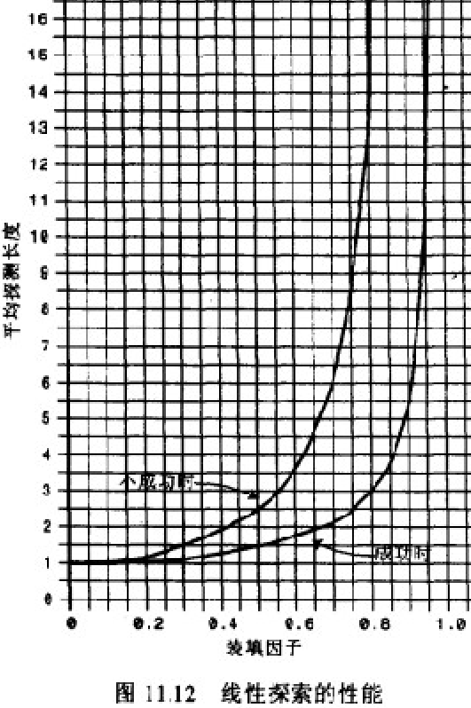

- **二次探测和再哈希化的性能:**
二次探测和再哈希法性能相当，它们的性能比线性探测略好。由下图可知，随着装填因子的变大，平均探测长度呈指数形式增长，需要探测的次数也呈指数形式增长，性能不高。


- **链地址法的性能：**

可以看到随着装填因子的增加，平均探测长度呈线性增长，较为平缓。在开发中使用链地址法较多，比如Java中的HashMap中使用的就是链地址法。

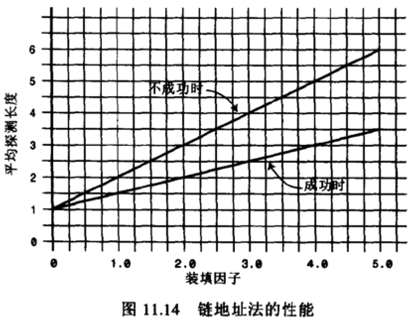

### 7.4 优秀的哈希函数
哈希表的优势在于它的速度，所以哈希函数不能采用消耗性能较高的复杂算法。提高速度的一个方法是在哈希函数中尽量减少乘法和除法。

性能高的哈希函数应具备以下两个优点：

- 快速的计算；
- 均匀的分布；

#### 7.4.1 快速计算

霍纳法则：在中国霍纳法则也叫做秦久韶算法，具体算法为：


求多项式的值时，首先计算最内层括号内一次多项式的值，然后由内向外逐层计算一次多项式的值。这种算法把求n次多项式f(x)的值就转化为求n个一次多项式的值。

**变换之前：**

乘法次数：`n（n+1）/2次`；
加法次数：n次；

**变换之后：**

乘法次数：n次；
加法次数：n次；
如果使用大O表示时间复杂度的话，直接从变换前的`O(N^2^)`降到了O(N)。

#### 7.4.1 均匀分布

为了保证数据在哈希表中均匀分布，当我们需要使用常量的地方，尽量使用质数；比如：哈希表的长度、N次幂的底数等。

Java中的HashMap采用的是链地址法，哈希化采用的是公式为：index = HashCode（key）&（Length-1）

即将数据化为二进制进行与运算，而不是取余运算。这样计算机直接运算二进制数据，效率更高。但是JavaScript在进行叫大数据的与运算时会出现问题，所以以下使用JavaScript实现哈希化时还是采用取余运算。

### 7.5 哈希函数的实现
设计哈希函数

- 1.将字符转成比较大的数字：hashCode
- 2.将大的数字hashCode压缩数组范围（大小）之内。

```js
function hashFunc(str,size) {
    //1.定义hashCode变量
    let hashCode = 0;

    //2.霍纳算法，来计算hashCode压缩数组范围（大小）之内
    //cat -> Unicode编码
    for(let i=0;i<str.length;i++) {
        //幂的指数，用37比较多
        // str.charCodeAt(i)//获取某个字符对应的unicode编码
        hashCode = 37 * hashCode + str.charCodeAt(i);
    }
    //3.取余操作
    let index = hashCode % size;
    return index;
}
```
测试：

```js
// 获取这些字符通过哈希函数之后取得的索引下标
console.log(hashFunc('abc',7)); //4
console.log(hashFunc('cba',7)); //3
console.log(hashFunc('aaa',7)); //0
console.log(hashFunc('cbf',7)); //1
console.log(hashFunc('nba',7)); //5
```

### 7.6 封装哈希表

哈希表的常见操作为：

- put（key，value）：插入或修改操作；
- get（key）：获取哈希表中特定位置的元素；
- remove（key）：删除哈希表中特定位置的元素；
- isEmpty（）：如果哈希表中不包含任何元素，返回trun，如果哈希表长度大于0则返回false；
- size（）：返回哈希表包含的元素个数；
resize（value）：对哈希表进行扩容操作；

在封装哈希表之前需要先加入哈希表的必要属性和哈希函数，在进行其他方法的实现。
```js
// 采用链地址法来实现
function HashTbale() {
    //属性
    this.storage = [];
    this.count = 0;  //计算已经存储的元素个数
    //装填因子：loadFactor > 0.75需要扩容，loadFactor < 0.25 时需要减少容量。

    // 方法
    //哈希函数
    HashTbale.prototype.hashFunc = function(str,size) {
        //1.定义hashCode变量
        let hashCode = 0;
        for(let i=0;i<str.length;i++) {
            hashCode = 37 * hashCode + str.charCodeAt(i);
        }
        let index = hashCode % size;
        return index;
    }  
}
```

#### 7.6.1 put(key,value)
哈希表的插入和修改操作是同一个函数，因为，当使用者传入一个`<key,value>`时，如果原来不存在该key,那么就是插入操作，如果原来已经存在该key，那么就是修改操作。


**思路：**
- 首先：根据key获取索引值index，目的是将数据插入到storage的对应位置。
- 然后，根据索引值取出bucket，如果bucket不存在，先创建bucket，随后防止在该索引值的位置。
- 接着，判断新增还是修改原来的值，如果已经有值了，就修改该值；如果没有，就执行操作。
- 最后，进行新增数据操作。

```js
    HashTable.prototype.put = function(key,value) {
        //1.根据key找到其对应的index
        let index = this.hashFunc(key,this.limit);

        //2.根据index取出对应的bucket
        let bucket = this.storage[index];

        //3.判断这个bucket是否存在
        if(bucket == null) {
            // 如果这个bucket为空，那就说明不存在，创建一个数组然后添加进storage中
            bucket = [];
            this.storage[index] = bucket;
        }

        //4.判断是否需要更改值
        for (let i = 0; i < bucket.length; i++) {
            let tuple = bucket[i];
            if (tuple[0] == key) {
            tuple[1] = value
            return; //不用返回值
            }
        }
    }
```
**测试：**
```js
// 插入函数
ht.put('student1','lin');
ht.put('student2','Tom');
ht.put('student3','Mary');
ht.put('student4','Boll');
ht.put('student5','why');

console.log(ht);
```


-------------
更新新中....

